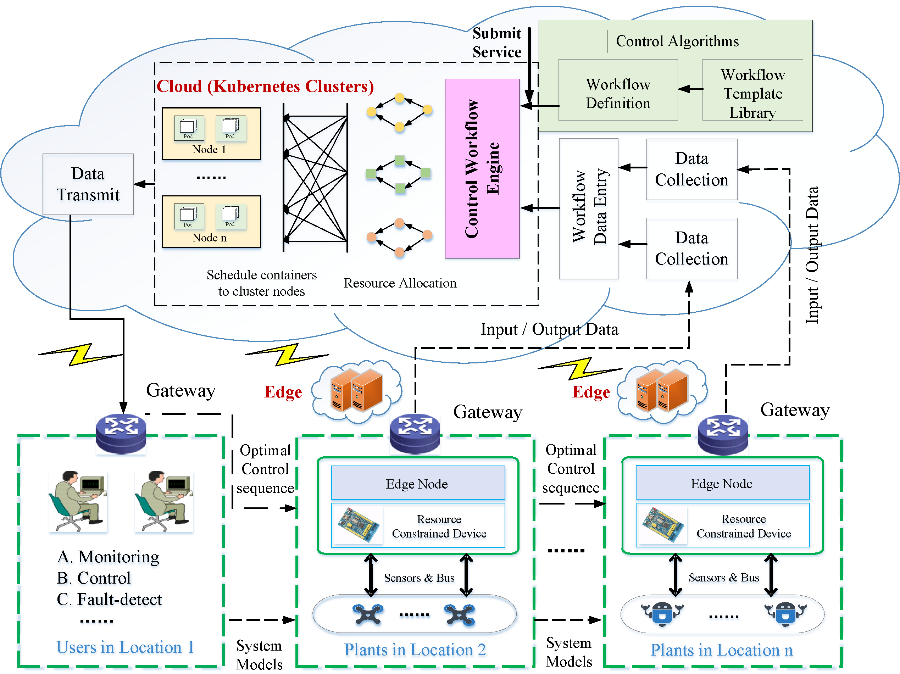
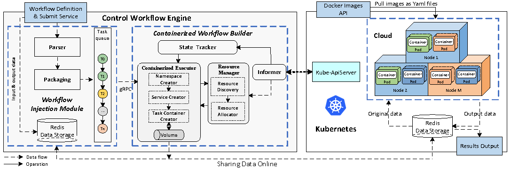

# ControlService: A contaierized solution for Control-Algorithm-as-a-Service in cloud control systems.
##Background
In recent years, cloud control systems (CCSs) have emerged as a new control paradigm to 
improve the service quality of emerging control missions, such as data-driven modeling, 
automated and connected vehicles, etc. The existing works have used the workflow-based 
restructured method to optimize the computation-intensive algorithms in the CCSs. 
However, there is still a gap in the concept of cloud services. The challenges here are 
how to define and submit these algorithms' workflows as cloud services and provide an 
automated workflow engine to execute these algorithms' workflows in a containerized 
manner. With these challenges, we propose a containerized solution for the 
Control-algorithm-as-a-Service (C3aS) in the CCSs, namely `ControlService`. 
It offers the control algorithm as a cloud workflow service and uses the customized 
workflow engine to realize the containerized execution of the cloud workflow service. 
First, we employ the cloud workflow representation method to define a control algorithm 
as an abstract cloud workflow form. Afterward, we provide the cloud service representation 
of abstract cloud workflow. Next, we design a workflow engine and submit the cloud service 
to this workflow engine to implement containerized execution of this cloud service in 
the CCSs.
##Access notification
Over the past two years, our team has been dedicated to the practical application research 
of cloud control systems (CCSs), trying to describe or run the control algorithm or 
application using cloud workflow. Up to now, a containerized solution for 
Control-Algorithm-as-a-Service (C3aS) named `ControlService` has been presented.
We have open-sourced the `ControlService`, which has been applied to the workflow 
containerized execution of subspace identification algorithm. The solution greatly 
accelerates the execution efficiency of subspace identification algorithm. 
YYou can deploy the `ControlService` solution and test the performance improvement of 
the subspace identification algorithm under the `ControlService` solution and the 
`Argo` solution.
We welcome you to download, learn, and work together to maintain the `ControlService` with 
us. If you use it for scientific research and engineering applications, please be sure 
to protect the copyright and indicate authors and source.

*A complete containerization solution for C3aS includes workflow-based cloud service 
definition, cloud service submission, workflow scheduling, and workflow execution. 
Its core functionalities are as follows:*

    1. Provide an interface to the public or private cloud in CCSs, allowing users to define 
    and submit cloud services of related algorithms on demand.

    2. Implement the containerized execution of related algorithm workflows
    item Provide the ability of flexible deployment and uninstall capabilities for the 
    proposed control workflow engine on the Kubernetes platform.

    3.Provide the ability of flexible deployment and uninstall capabilities for the proposed 
    control workflow engine on the Kubernetes platform.

##Resource description
### ./ControlWorkflowEngine
`Control Workflow Engine` works to not only translate abstract tasks to task pods to execute them but also to manage the executable containerized workflow, schedule task pods, and handle 
failures.

*The Control Workflow Engine consists of two main top-level entities. Both entities serve as core modules to implement containerized execution of control workflows, run in the form of pod, and talk to each other via gRPC.*

This directory includes `TaskContainerBuilder` and `WorkflowInjector` directories. More information on `Control Workflow Engine` refers to our former work:

    1. Chenggang Shan, Yuanqing Xia, Yufeng Zhan, Jinhui Zhang. KubeAdaptor: A docking framework for workflow containerization on Kubernetes[J]. Future Generation Computer Systems, 2023, 148:584–599. 
       Github：https://github.com/CloudControlSystems/KubeAdaptor
### ./Argo-solution
`./exp` directory includes deployment files of SID workflows with concurrency levels 5 and 10 for Argo workflow engine.

`./sid-source` directory contains the Python source code and Dockerfile files for each task, 
as well as related operation files about Image resources between cluster Argo cluster nodes.

`install-3.1.8` is the deployment file of Argo workflow engine 3.1.8.

### ./CotrolService-solution
`./exp` directory contains the deployment and configuration files of `Control Workflow Engine` in the `ControlService` solution. 
Refer to ``https://github.com/CloudControlSystems/KubeAdaptor`` for details on the startup and configuration process.
`Control Workflow Engine` is a version of `KubeAdaptor` for the containerization of control algorithm workflows in the CCSs.

`./sid-source` directory contains the Python source code and Dockerfile files for SID workflows with concurrency levels 5 and 10 in `ControlService` solution.

### Hardware and software Description 
#### Software Prerequisites
1. OS version: Ubuntu 20.4/CentOS Linux release 7.8
2. Kubernetes: v1.19.6
3. Argo 3.3.8
4. Docker: 18.09.6.
#### Infrastructure specification
1. aliyun ecs.hfc6.2xlarge (for Argo and ControlService)
2. aliyun ecs.hfc6.xlarge (for single machine operation mode)
